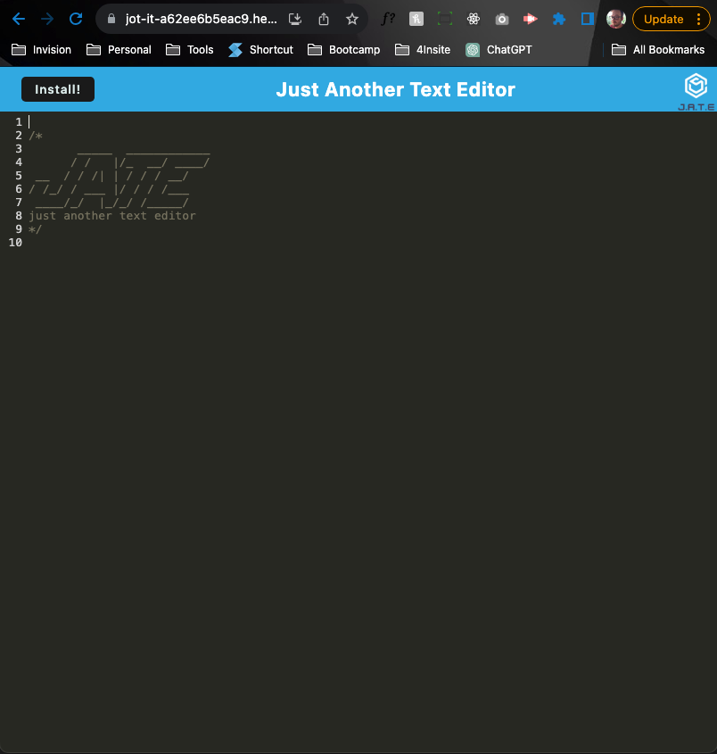

# Just Another Text Editor

## Description

There are a lot of text editors in the world. Some have smart syntax that will help auto complete code snippets. Some have linters that will help organize your code in an easy to read format. If those things annoy you can use Just Another Text Editor, or JATE for short. No more of that pesky, annoying format technology. Just a simple, plain, boring text editor. Keep it simple and edit text old fashioned way with JATE.

## Table of Contents

- [Intallation](#installation)
- [Usage](#usage)
- [Credits](#credits)
- [License](#license)
- [Assets](#assets)

## Installation

`npm i` will run a script to install all dependencies in the root directory as well as the client and server folders. Be mindful of the devDependencies vs dependencies.

- root
  - express
  - nodemon
  - concurrently (for scripts)
- server
  - express
  - nodemon
- client
  - babel and related packages
  - webpack and related packages
  - workbox for webpack

## Usage

Usage of the application is open source. Contributors are able to clone the repo and add code. Please create a PR before merging to main.

## Credits

- Jeffrey Gunn - Caching, PWA, Service Worker, Webpack Bundling
- UC Davis Full Stack Web Development course - Starter Code

## License

No license information for this application

## Assets

[Github Repository](https://github.com/jsgunn22/text-editor)

